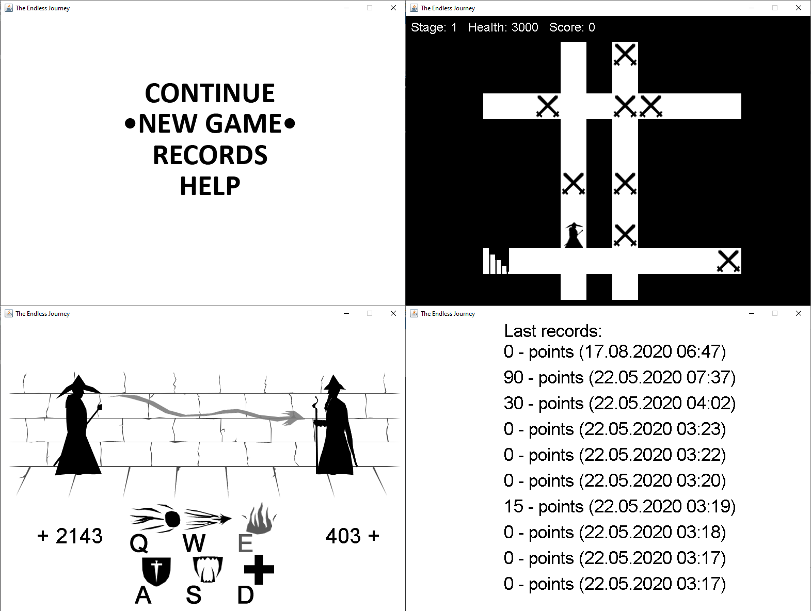

# TheEndlessJourney

## Implementation details
* Java 8
* Swing
* AWT
* Gson

## About game
This is the desktop 2D game with real-time (like a fighting game) and turn-based (travel on random maps) modes.
Opponents have different behavior, which depends on the type of opponent. Each new level restores your health and increases the health of opponents. The number of points for the victory over the enemy is growing at each level.
### Map controls:
* Arrow keys
### Battle controls:
* Q: Simple attack spell
* W: Piercing attack spell (ignores blocking)
* E: Attack spell with self-burning (the enemy burns when he attacks)
* A: Blocking spell
* S: Health drain (ignores blocking and drains health)
* D: Heal
### Screenshots

